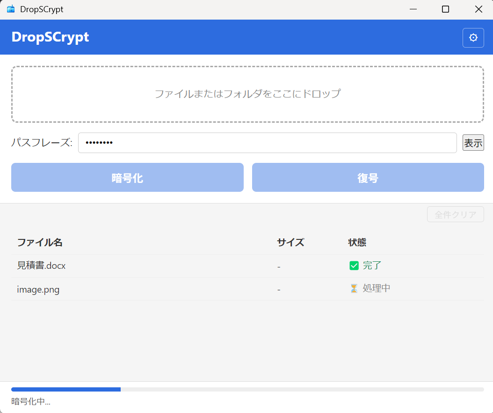

# DropSCrypt

## 概要

ドラッグ＆ドロップでファイルを暗号化・復号できる Windows 向け Electron アプリです。GnuPG (`gpg.exe`) による AES-256 対称暗号方式を使用しています。



> **注意:** このアプリは学習目的で作成されています。実際のセキュリティ用途には使用しないでください。

## 動作要件

- Windows 10 / 11 (64-bit)
- [GnuPG](https://www.gnupg.org/)（`gpg.exe`）がインストールされ `PATH` に通っていること

## 使い方

1. アプリを起動する
2. パスフレーズを入力する
3. ファイルまたはフォルダをドロップエリアにドラッグ＆ドロップする
4. **暗号化** または **復号** を選んで実行する

- **暗号化:** 同じフォルダに `.gpg` 拡張子付きの暗号化ファイルを保存します
- **復号:** `.gpg` ファイルから元のファイルを同じフォルダに復元します

## 開発

```bash
npm install
npm start      # 開発モードで起動
npm run dist   # Windows インストーラーを dist/ に生成
```
